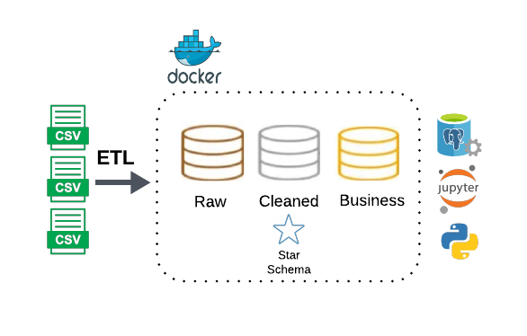

# ETL Pipeline with Medallion Architecture & Star Schema (with Dockerized Postgres, Jupyter Notebook, and Python). 



## Table of Contents

- [Project Structure](#Project-Structure)
- [Setup Instructions](#Setup-Instructions)
  - [Prerequisites](#Prerequisites)
  - [Environment Variables](#Environment-Variables)
  - [Build and Run](#Build-and-Run)
- [Services](#services)
- [Project Definition](#Project-Definition)
  - [Medallion Architecture](#Medallion-Architecture)
  - [Source](#Source)
  - [Creating Schemas-Tables-Views](#Creating-Schemas-Tables-Views)
  - [Data Integrity](#Data-Integrity)
  - [Bronze Layer](#Bronze-Layer)
  - [Silver Layer](#Silver-Layer)
  - [Gold Layer](#Gold-Layer)
  - [The ETL Jupyter Notebook](#The-ETL-Jupyter-Notebook)
  - [The ETL Process](#The-ETL-Process)
  

## Project Structure

- **name_of_your_project_repo (project-root)/**
    - **.devcontainer/**
      - devcontainer.json
    - **sql_scripts/**
      - **schemas/**
        - create_schemas.sql
      - **bronze/**
        - create_bronze_tables.sql
      - **silver/**
        - create_silver_views.sql
      - **gold/**
        - create_gold_views.sql
    - **data/**
      - **raw/**
        - the_raw_CSV_files.csv
    - **img/**
      - your_README_images.png
    - **your_jup_notebooks/**
      - etl_pipeline.ipynb
    - **run_sql_scripts**
    - **.env**
    - **.gitignore**
    - **.python-version**
    - **Dockerfile**
    - **docker-compose.yml**
    - **requirements.txt**
    - **README.md**

## Setup Instructions

### Prerequisites

Make sure you have the following installed on your local development environment:

- [Docker](https://www.docker.com/get-started)
- [Docker Compose](https://docs.docker.com/compose/install/)
- [VSCode](https://code.visualstudio.com/) with the [Remote - Containers extension](https://marketplace.visualstudio.com/items?itemName=ms-vscode-remote.remote-containers)

Make sure to inclue a .gitignore file with the following information:
- *.pyc (to ignore python bytecode files)
- .env (to ignore sensitive information, such as database credentials)
- data/* (to ignore the source data, such as CSV files)

### Environment Variables

The .gitignore file, ignores the ´.env´ file for security reasons. However, since this is just for educational purposes, follow the step below to include it in your project. If you do not include it, the docker will not work.

Create a `.env` file in the project root with the following content:

- POSTGRES_USER=your_postgres_user
- POSTGRES_PASSWORD=your_postgres_password
- POSTGRES_DB=your_postgres_db
- POSTGRES_HOST=postgres
- JUPYTER_TOKEN=123

### Build and Run

1. **Clone the repository:**

   ```bash
   git clone https://github.com/caiocvelasco/project02-docker-medallion-postgres-kimball-star-schema.git
   cd my-first-docker-project

2. **Build and start the containers:**

    When you open VSCode, it will automatically ask if you want to reopen the repo folder in a container and it will build for you.

    **Note:** I have included the command `"postCreateCommand": "docker image prune -f"` in the __.devcontainer.json__ file. Therefore, whenever the docker containeirs are rebuilt this command will make sure to delete the `unused (dangling)` images. The `-f` argument ensures you don't need to confirm if you want to perform this action.

### Services

- **Postgres**: 
  - A PostgreSQL database instance.
  - Docker exposes port 5432 of the PostgreSQL container to port 5432 on your host machine. This makes service is accessible via `localhost:5432` on your local machine for visualization tools such as PowerBI and Tableau. However, within the docker container environment, the other services will use the postgres _hostname_ as specified in the `.env` file (`POSTGRES_HOST`).
  - To test the database from within the container's terminal: `psql -h $POSTGRES_HOST -p 5432 -U $POSTGRES_USER -d $POSTGRES_DB`
- **Python**: A container running Python 3.9.13 with necessary dependencies.
- **Jupyter Notebook**: A Jupyter Notebook instance to build your ETL Pipeline and interact with the data. 

## Project Definition

### Medallion Architecture
  * I created 3 schemas within the PostgreSQL database to mimic the Medallion Architecture (bronze, silver, and gold layers) usually found in Data Warehouse solutions. 
  * The schemas can be found within the __sql_scripts__ folder and are called:
    * bronze (the raw layer, where we store raw data, no transformations)
    * silver (the data model layer, where we transform the data following the Star Schema Data Model (Kimball), a type of Dimensional Modelling)
    * gold (the analytics layer, where we build the final tables ready to be consumed by analysts)

### Source
The source data is composed of CSV files, each one containing the name of a table to be created in each layer/schema.

Although the `data/` folder was ignored in the `.gitignore` file, the source data (CSV files) can be found in `data/raw`.

### Creating Schemas-Tables-Views
  * Running __/workspace/your_jup_notebooks/elt_pipeline_bronze_silver.ipynb__
    * You should run the __elt_pipeline_bronze_silver__ jupyter notebook. This will create all tables into the Bronze layer (with a function that runs a `.sql` script), ingest the data, then create all tables into the Silver layer in the same way, ingested the data from bronze into silver, then do the same for the gold layer.

### Data Integrity

  * For Data Integrity, the follwoing components were ensured in the data flow process:
    * Data Accuracy: Ensuring that data is correct and free from errors.
    * Data Consistency: Ensuring that data is consistent across different systems and datasets.
    * Data Completeness: Ensuring that all required data is present.
    * Data Standardization: Ensuring that data follows consistent formats and naming conventions.
      * snake_case
      * '_id' at the end if id
    * Data Validation: Implementing checks to ensure data meets certain criteria before it is processed or stored.

### Bronze Layer

  * Tables or Views?
    * In the Bronze layer, we created `Tables`.
    * (Performance) Materialized tables can provide better performance for complex queries since the data is precomputed and stored. This especially useful when dealing with large volumes of data.

  * Data Ingestion
    * The bronze layer works as an initial **landing zone** for ingested data. The tables are:
      * customers
      * dates
      * product_usage 
      * products
      * subscriptions
      * support_interactions
    * Initial dimension tables are typically built in the bronze layer to capture raw attribute data from source systems. Thus, five tables were created in the bronze layer and data was ingested.

    * Data Integrity
      * Data is loaded into the bronze layer with minimal transformation, preserving the original structure and content from the source CSV files.

    * Normalization:
      * Tables are still normalized, hence suitable for subsequent transformation into the silver and gold layers.
    
### Silver Layer
  
  * Tables or Views?
    * In the Silver layer, we should create `Views`, but we created `Tables` just for learning purposes.
    * (Real-Time Data) Views can provide up-to-date data as they are essentially saved queries that are executed in real-time when accessed. Any changes in the underlying bronze tables are immediately reflected in the views, ensuring that the data is always up-to-date with the latest records in the bronze layer.

  * Data Integration and Transformation
    * Brings together data from multiple sources (e.g., multiple CSV files) to create unified views or tables. The tables are:
      * Dimensions
        * dim_customers
        * dim_dates
        * dim_products
      * Facts
        * fact_subscriptions
        * fact_product_usage
        * fact_support_interactions
    * The tables in the silver layer integrate and transform data from the bronze layer, preparing it for the gold layer where further analytical views/tables and metrics can be defined.

    * Data Integrity
      * Consistent and standardized naming conventions:
        * snake_case
        * '_id' at the end if id

    * Normalization:
      * Dimension tables are designed to hold descriptive attributes and are typically denormalized for performance in query operations.
      * Fact tables are normalized to ensure they hold only measurable, quantitative data, linked via foreign keys to the dimension tables.
      * This process helps maintain data consistency and integrity by structuring data into related tables and establishing clear relationships among them.

### Gold Layer

  * Data Aggregation and Feature Engineering
    * Data in the Gold layer is often used to build predictive models for tasks like churn prediction. It is pre-processed and structured to facilitate the development of machine learning models for predictive analytics

### The Jupyter Notebook
  This is the jupyter notebook that performs the whole ETL process within all layers in the Medallion Architecture. It is located under the `project-root > your_jup_notebooks` folder.

  The reason to use a Jupyter Notebook is to facilitate the user to see all the process in the same place. I always build something with the intention of sharing it later. **Therefore, documentation and "making it easier for the next person" are crucial factors in everything I build.**

  [WORK IN PROGRESS]